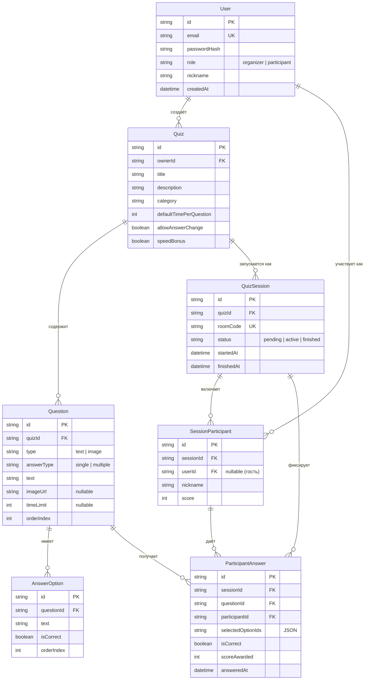
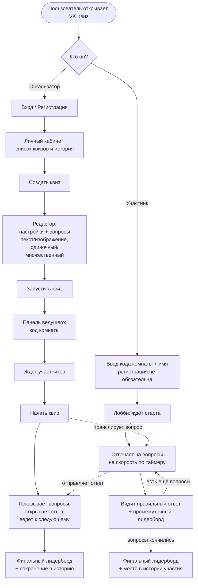
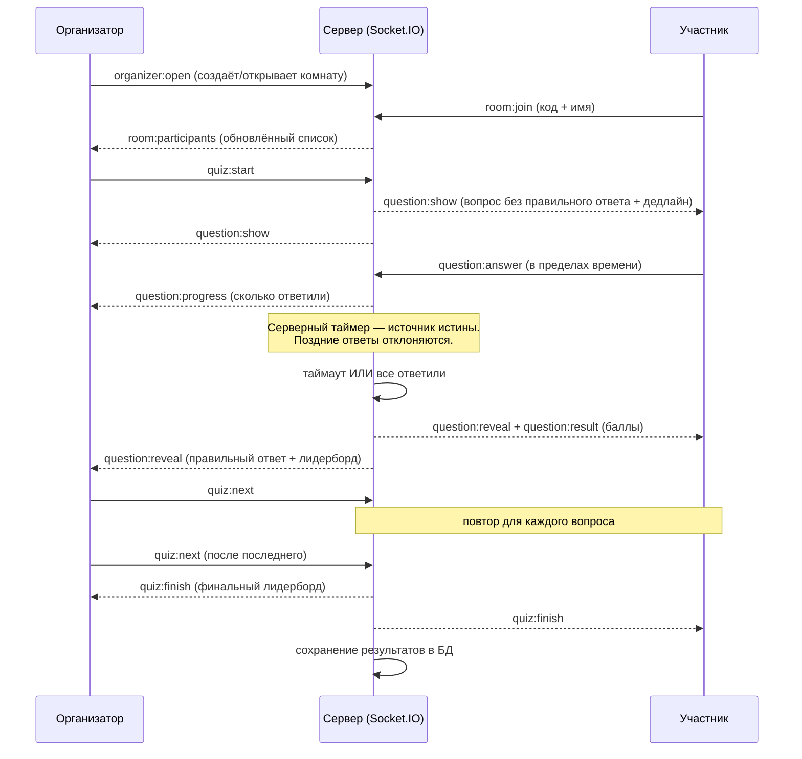
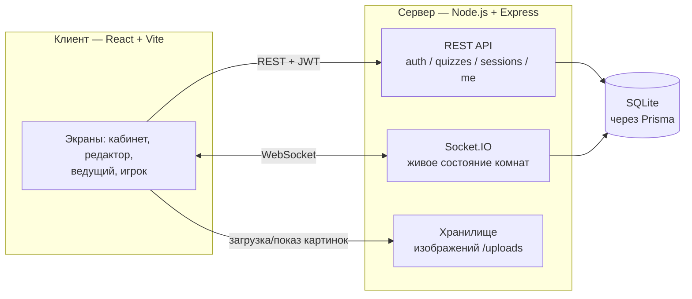

# Диаграммы (Mermaid) для Miro

Как использовать: в Miro на левой панели → **Apps** → найди **Mermaid** →
вставь любой блок кода ниже → диаграмма построится автоматически. Каждый блок —
отдельная диаграмма (вставляй по одному).

---

## 1. Модель базы данных (ER-диаграмма)

---

## 2. Пользовательский сценарий (User Flow)

---

## 3. Проведение квиза в реальном времени (Sequence)

---

## 4. Архитектура системы (компоненты)

